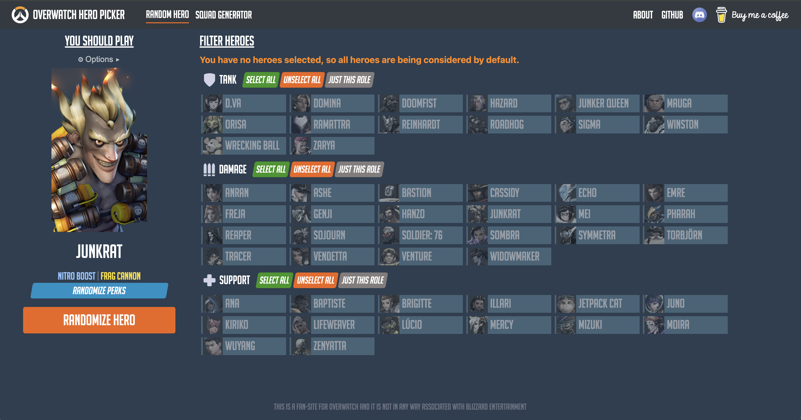

Repository for the Random Hero Picker for Overwatch.
This website allows Overwatch players to get a random suggestion of which hero to play based on a selection of heroes made by the player.

- **Website:** https://owheropicker.com

## Bugs and feature requests

If you find any bug or have a feature request, please post it on the [issue section](https://github.com/andrerfcsantos/overwatch-hero-picker/issues) of this repository.

## Feedback

Any feedback that is not a bug report or a feature request, please send to owheropicker@gmail.com. You can also join the [discord server](https://discord.gg/rwQMrCa).

## Tech Stack

- [Next.js](https://nextjs.org/) (App Router)
- [React](https://react.dev/)
- [TypeScript](https://www.typescriptlang.org/)
- [Tailwind CSS](https://tailwindcss.com/)
- [ESLint](https://eslint.org/) + [Prettier](https://prettier.io/)

## Building the site from source

Use these instructions to build the site from the source code and having it run on your own machine or server.

### Prerequisites

- [Node.js](https://nodejs.org/en/) (v18 or later)

### Running the site

- Clone the repo
- `cd` into the repo folder
- `npm install` to install the dependencies
- You can now run the site using `npm` directly or generate static files:
  - `npm run dev` to serve the site on localhost in development mode
  - `npm run build` to generate a production build
  - `npm run start` to serve the production build on localhost
