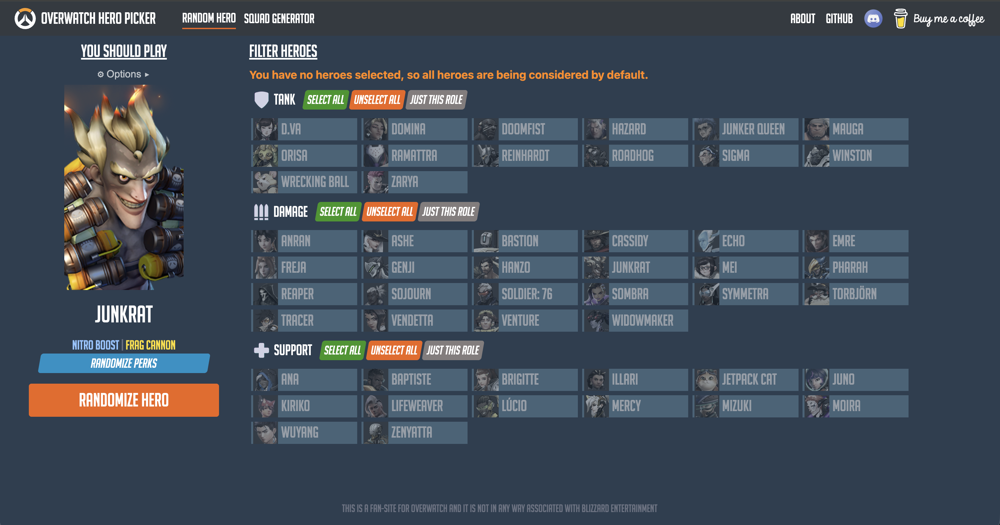

Repository for the Random Hero Picker for Overwatch.
This website allows Overwatch players to get a random suggestion of which hero to play based on a selection of heroes made by the player.

- **Website:** https://owheropicker.com

## Bugs and feature requests

If you find any bug or have a feature request, please post it on the [issue section](https://github.com/andrerfcsantos/overwatch-hero-picker/issues) of this repository.

## Feedback

Any feedback that is not a bug report or a feature request, please send to owheropicker@gmail.com. You can also join the [discord server](https://discord.gg/rwQMrCa).

## Tech Stack

- [Next.js](https://nextjs.org/) (App Router)
- [React](https://react.dev/)
- [TypeScript](https://www.typescriptlang.org/)
- [Tailwind CSS](https://tailwindcss.com/)
- [ESLint](https://eslint.org/) + [Prettier](https://prettier.io/)

## Building the site from source

Use these instructions to build the site from the source code and having it run on your own machine or server.

### Prerequisites

- [Node.js](https://nodejs.org/en/) 24 (the active LTS line)

The required major is declared in `package.json` in two places: `engines.node`,
which makes `npm install` fail on the wrong major (`engine-strict=true` is set in
`.npmrc`), and `devEngines.runtime`, which [Vite+](https://viteplus.dev) uses to
download and select the right runtime automatically. `@types/node` is kept on the
same major so the types match what actually runs.

### Running the site

- Clone the repo
- `cd` into the repo folder
- `npm install` to install the dependencies
- You can now run the site using `npm` directly or generate static files:
  - `npm run dev` to serve the site on localhost in development mode
  - `npm run build` to generate a production build
  - `npm run start` to serve the production build on localhost

## Upgrading dependencies

Every dependency is declared as a caret range, so `vp update` is free to move
within a major. The lockfile is what pins exact versions.

| Command                     | What it does                                                                                |
| --------------------------- | ------------------------------------------------------------------------------------------- |
| `npm run deps:check`        | Reports the Node.js version alignment and splits pending updates into minor/patch and major |
| `npm run deps:update`       | Applies every minor/patch update the declared ranges already allow                          |
| `npm run deps:update:major` | Interactively picks major updates, which widen the ranges in `package.json`                 |

`deps:update` is the routine one — it only moves the lockfile, so `package.json`
stays untouched and the changes are non-breaking by semver. Run `vp check` and
`npm run build` afterwards and commit `package-lock.json`.

`deps:update:major` crosses major boundaries and needs real testing: read the
changelog for each package, take them one at a time where possible, and validate
with `vp check` and `npm run build` before committing.

Bumping `@types/node` across a major is a Node.js upgrade, not a types upgrade.
Do it together with `vp env pin <major>` and a matching `engines.node`, in one
commit — `npm run deps:check` fails if the three ever disagree.

`npm run deps:check -- --ci` exits non-zero when the Node.js declarations are out
of sync or when in-range updates are pending, which makes it usable as a CI gate.
