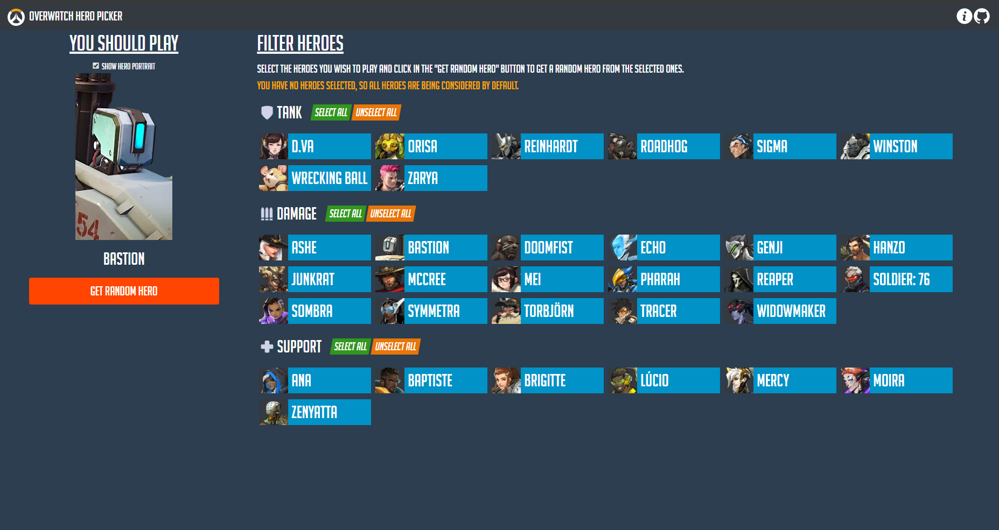

Repository for the Random Hero Picker for Overwatch.
This website allows Overwatch players to get a random suggestion of which hero to play based on a selection of heroes made by the player.

* **Website:** https://owheropicker.com

## Bugs and feature requests

If you find any bug or have a feature request, please post it on the [issue section](https://github.com/andrerfcsantos/overwatch-hero-picker/issues) of this repository.

## Feedback

Any feedback that is not a bug report or a feature request, please send to owheropicker@gmail.com. You can also join the [discord server](https://discord.gg/rwQMrCa).

## Building the site from source

Use these instructions to build the site from the source code and having it run on your own machine or server.

### Prerequisites

* [Node](https://nodejs.org/en/)
* [Vue Cli](https://cli.vuejs.org/guide/installation.html)

### Running the site

* Clone the repo
* `cd` into the repo folder
* `npm install` to install the dependencies
* You can now run the site using `npm` directly or generate static files that can be served by a webserver:
    * `npm run serve` to serve the site on localhost
    * `npm run build --prod` to generate the site static files. This command will put all the files under a `dist` directory. These files should then be put behind a webserver to serve the site.
